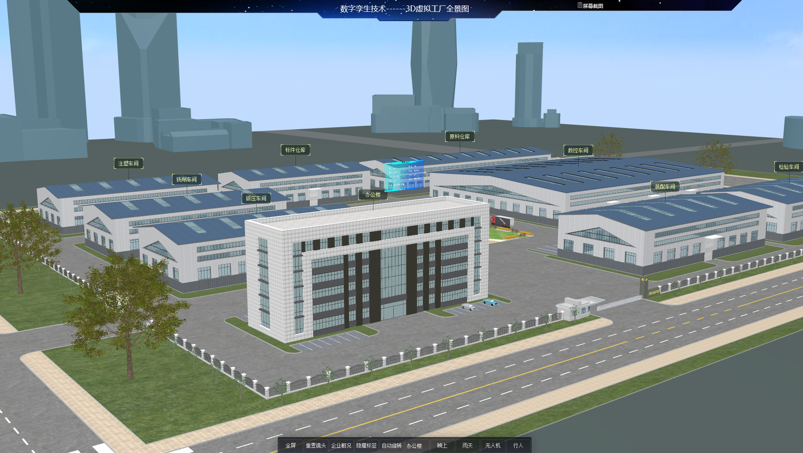
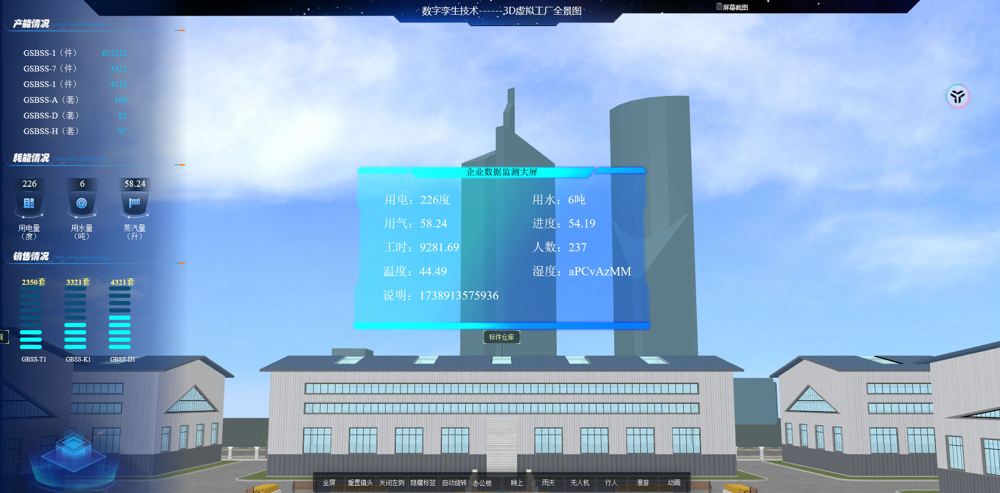
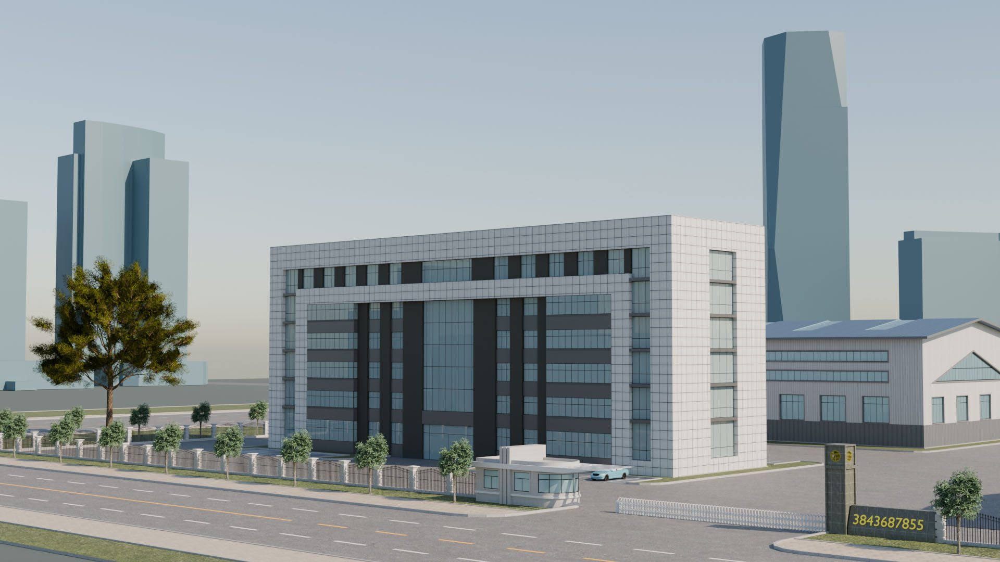
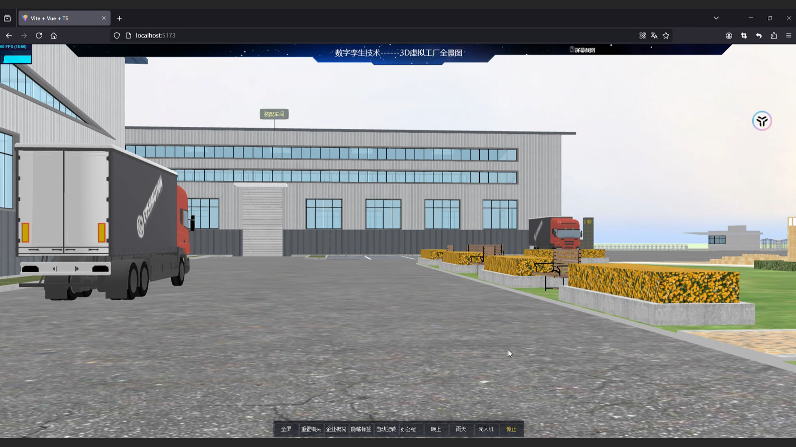
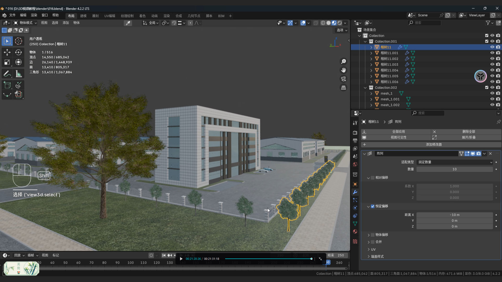
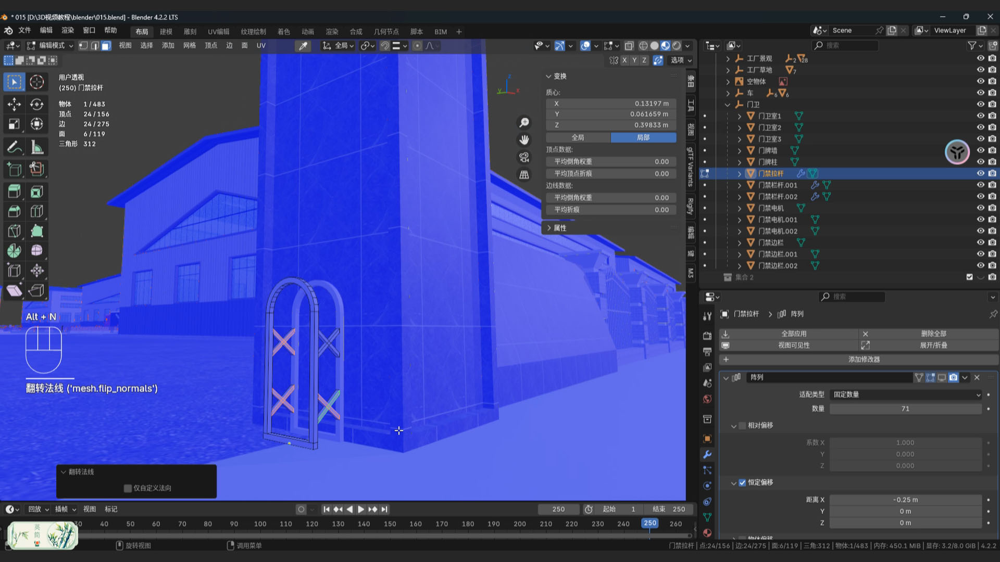

# Vue3 + Three.js 3D虚拟工厂解决方案

[联系方式]
QQ：**3843687855**
网络地址：**http://www.zjzqrj.cn/** 
## 🌟 项目简介
采用 **Vue3** + **Three.js** + **Blender** 技术栈开发的沉浸式3D虚拟工厂系统，实现高精度工业场景数字化呈现与实时数据交互。

## 🚀 功能介绍

| 功能模块          | 内容                          |
|-------------------|-----------------------------------|
| 🖱️ 一键全屏       | 全屏API无缝切换                   |
| 📷 镜头重置       | 调整视角             |
| 📊 企业数据可视化 | 对接WEBAPI/MQTT实时数据           |
| 🏷️ 智能标签       | 厂房分类          |
| 🔄 自动旋转       | 全方位展示                  |
| 🏢 楼层拆解       | 立体分解模型        |
| 🌗 昼夜切换       | 白天晚上切换           |
| 🌧️ 雨天特效       | 晴天雨天切换               |
| 🚁 无人机视角     | 轨道控制              |
| 🚶‍♂️ 行人视角       | 行人模式              |

## 🖼️ 效果展示






 

## 🛠️ 快速开始

```bash
# 安装依赖
npm install --save vue-router@4 axios pinia element-plus
npm install three
npm install paho-mqtt
npm install tweenjs
npm install @types/node
npm install sass
npm install

# 开发模式
npm run dev

# 生产构建
npm run build